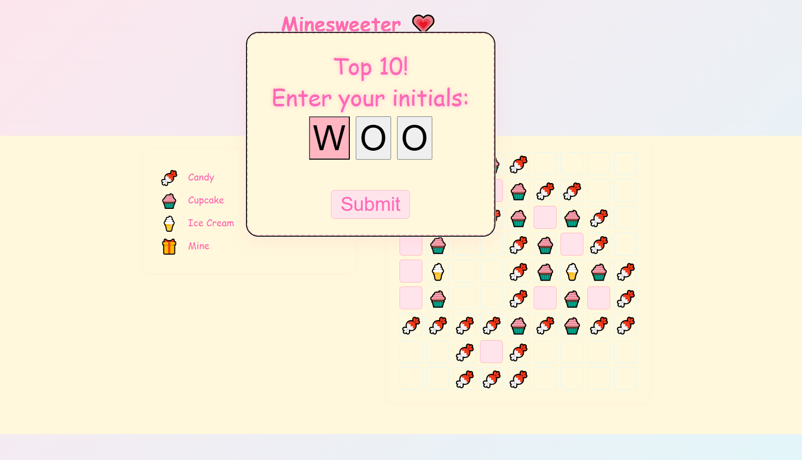

# Minesweeter: Kawaii Candy & Sweets Theme 💗

A web-based Minesweeper variant with a cute, candy-inspired theme featuring pastel colors and sweet emoji icons.

*Main game interface showing the kawaii candy theme with game legend and active gameplay*

## Features
- **Sweet Theme**: Candy 🍬, cupcake 🧁, and ice cream 🍦 icons instead of numbers
- **Pastel Interface**: Soft pink and cream color palette
- **Game Legend**: Clear visual guide for different mine count indicators
- **Timer & Mine Counter**: Track your progress as you play
- **Multiple Difficulty Levels**: Beginner (9x9), Intermediate (16x16), Advanced (24x24)
- **Responsive Design**: Clean, accessible interface

## Screenshots

### Gameplay

*Main interface showing the sweet candy theme with mine counter, timer, and game legend*

### Victory Screen

*Top 10 leaderboard entry screen where players can enter their 3-letter initials after winning*

## How to Run
Just open `index.html` in your browser.

## Assets
All images/icons are placeholders. Replace them with your own for production use.

## Customization
- Update `style.css` for colors and layout
- Update `main.js` for game logic and new features

---

Enjoy your sweet Minesweeper experience!
